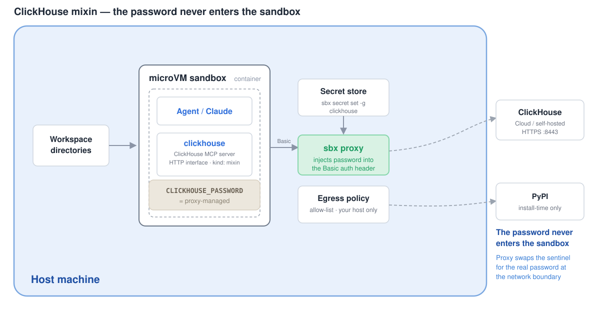

# ClickHouse mixin (remote connector)

Connects an agent's Docker Sandbox to a **remote ClickHouse** warehouse
(ClickHouse Cloud or self-hosted) through the official
[ClickHouse MCP server](https://github.com/ClickHouse/mcp-clickhouse). The agent
gets structured tools to list databases/tables and run read queries against your
real warehouse — inside an isolated microVM, under a `deny-all` network policy,
with the password injected by the sbx proxy so it **never enters the container**.



## Why this is a good fit for sbx

ClickHouse is most useful pointed at real data, and that's exactly where the
sandbox model pays off: the agent can explore your warehouse while (a) it can
only reach the one host you allow-list, and (b) it never sees the password — the
proxy holds it and injects it on the wire.

## How the credential stays out of the container

1. `CLICKHOUSE_PASSWORD` is set to the sentinel `proxy-managed` inside the sandbox.
2. `clickhouse-connect` (used by the MCP server) authenticates over the HTTP
   interface with `Authorization: Basic base64(user:proxy-managed)`.
3. The proxy recognizes the allow-listed host + `scheme: basic` and swaps the
   sentinel for your real password on the outbound request.

The ClickHouse **native** protocol (port 9000/9440) is raw TCP and cannot be
injected this way — so this kit drives ClickHouse over the **HTTP interface**
(8443 for Cloud, 8123 for plain HTTP).

## Configure

**1. Set the connection target** with the helper — it rewrites every place the
value must match (the host lives in **3** spots, the user in **2**) and
re-validates, so nothing can drift:

```bash
scripts/set-host.sh <your-host>.clickhouse.cloud
# with options:
scripts/set-host.sh ch.internal.example.com --user analyst --port 8123 --secure false
```

These are all non-secret values (defaults shown); the helper edits them in
[`spec.yaml`](./spec.yaml):

| value | default | meaning |
|-------|---------|---------|
| `CLICKHOUSE_HOST` | `CHANGE_ME.clickhouse.cloud` | your HTTP(S) host, no scheme/port |
| `CLICKHOUSE_PORT` | `8443` | `8443` Cloud HTTPS · `8123` plain HTTP |
| `CLICKHOUSE_USER` | `default` | ClickHouse username |
| `CLICKHOUSE_DATABASE` | `default` | default database |
| `CLICKHOUSE_SECURE` | `true` | `true` for TLS/Cloud, `false` for plain HTTP |

> In this v0.39.0 grammar there's no `args` templating, so these are plain
> literals that must stay in sync — `set-host.sh` is the single source of truth
> so they can't diverge (a drift the validator won't catch but the engine
> rejects at run time).

**2. Set the password** (never stored in the kit):

```bash
sbx secret set -g clickhouse        # prompts for the value; stored in your secret store
```

Or point sbx at where the password already lives, in
`~/.config/sbx/credentials.yaml`:

```yaml
bindings:
  clickhouse:
    discovery:
      - env: [CLICKHOUSE_PASSWORD]
      # or: - file: { path: "~/.clickhouse/password.txt" }
    allowedDomains:
      - <your-host>.clickhouse.cloud   # must match CLICKHOUSE_HOST / inject domain
```

## Usage

Published OCI artifact:

```bash
sbx run claude --kit docker.io/ajeetraina777/clickhouse-kit:latest .
```

From a pinned git ref:

```bash
sbx run claude --kit "git+https://github.com/ajeetraina/sbx-kits-clickhouse.git#ref=<40-hex-sha>" .
```

Local path (while authoring):

```bash
sbx run claude --kit . .
```

## Verify

```bash
sbx kit validate .
sbx kit inspect  .                             # confirm host resolved into inject + allow

# End to end
sbx run claude --kit . --name ch-probe .
sbx exec ch-probe -- /home/agent/.local/bin/mcp-clickhouse --help   # server installed?
sbx exec ch-probe -- claude mcp list                                # registered?
# then ask the agent: "list the ClickHouse databases"
sbx rm ch-probe
```

## Notes & limitations

- **HTTP interface only.** No `clickhouse-client` (native protocol) — its auth
  can't be proxy-injected. `curl` against the HTTP interface works too, since
  Basic auth to the allow-listed host is injected.
- **TLS verification.** `CLICKHOUSE_VERIFY` defaults to `false` because the
  proxy terminates TLS inside the container with its own CA, which
  `clickhouse-connect`'s bundled `certifi` store does not trust. The
  proxy→warehouse hop is still TLS-verified, so the connection to ClickHouse
  stays protected. To verify end to end instead, point `clickhouse-connect` at
  the proxy CA and set `CLICKHOUSE_VERIFY: "true"`.
- **Read-only.** `mcp-clickhouse` runs queries with `readonly=1` by default.
- **Cloud port.** Confirm your proxy policy permits HTTPS CONNECT to `:8443`
  (not just `:443`). If queries hang, check that first.
- **Claude-oriented.** The startup hook registers the MCP server via
  `claude mcp add`; on non-Claude agents it's a no-op — copy
  `~/.clickhouse/mcp.json` into that agent's MCP config instead.

## Publishing

This repo publishes the kit to Docker Hub as an OCI artifact via
[`scripts/push-kits.sh`](scripts/push-kits.sh) (and the
[`Publish Kit`](.github/workflows/push-kits.yaml) workflow on push to `main`):

```bash
DOCKERHUB_NAMESPACE=ajeetraina777 TAG=latest bash scripts/push-kits.sh
```

The workflow needs `DOCKERHUB_USERNAME` / `DOCKERHUB_TOKEN` repo secrets.

## License

MIT — see [LICENSE](LICENSE).
